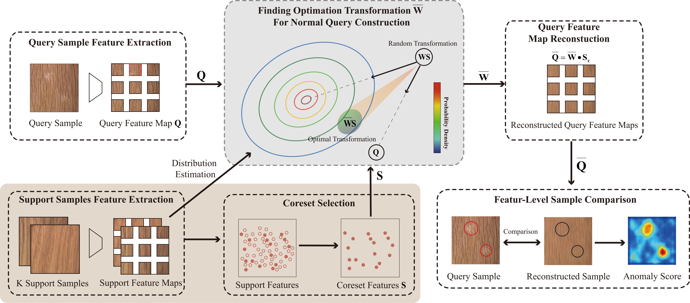

# FastRecon:Few-shot Industrial Anomaly Detection via Fast Feature Reconstruction

Paper
---------------

[Paper](https://paperswithcode.com/paper/fastrecon-few-shot-industrial-anomaly)

In industrial anomaly detection, data efficiency and the ability for fast migration across products become the main concerns when developing detection algorithms. Existing methods tend to be data-hungry and work in the one-model-one-category way, which hinders their effectiveness in real-world industrial scenarios. In this paper, we propose a few-shot anomaly detection strategy that works in a low-data regime and can generalize across products at no cost. Given a defective query sample, we propose to utilize a few normal samples as a reference to reconstruct its normal version, where the final anomaly detection can be achieved by sample alignment. Specifically, we introduce a novel regression with distribution regularization to obtain the optimal transformation from support to query features, which guarantees the reconstruction result shares visual similarity with the query sample and meanwhile maintains the property of normal samples. Experimental results show that our method significantly outperforms previous state-of-the-art at both image and pixel-level AUROC performances from 2 to 8-shot scenarios. Besides, with only a limited number of training samples (less than 8 samples), our method reaches competitive performance with vanilla AD methods which are trained with extensive normal samples.

The code will be available soon.



Overview of our method. Feature maps of each query sample and support samples are exacted by a pre-trained encoder. Features from support images are aggregated into a support feature pool. This pool is down-sampled through greedy coreset selection as $S$ to reduce data redundancy and improve inference speed. The coreset $S$ and the original query feature map $Q$ are then input to our proposed regression with distribution regularization as shown in the grey region. An optimal transformation $\bar{W}$ between $S$ and $Q$ is obtained by the regression to make sure the reconstructed sample $\bar{W} S$, denoted as $\bar{Q}$, to share similarity with $Q$ but keeps all the property of normal samples. Finally, we align $\bar{Q}$ and Q for direct comparison to obtaining the anomaly estimation.


Qualitative results of anomaly localization for both MVTec and MPDD datasets. The first row in the red box presents the support sample for each category while the second row indicates the query samples. The results show that our method can provide accurate localization of defect regions even for more complicated patterns in MPDD.

Usage
---------------

This code is based on the project [PatchCore_anomaly_detection](https://github.com/hcw-00/PatchCore_anomaly_detection#usage)

```
# install python 3.6, torch==1.8.1, torchvision==0.9.1
pip install -r requirements.txt

python main.py --phase train or test --dataset_path .../mvtec_anomaly_detection --category carpet --project_root_path path/to/save/results --coreset_sampling_ratio 0.01 --n_neighbors 9
```

Experiment Results
---------------------
\begin{table*}[t]
\caption{FSAD performance comparisons on MVTec and MPDD dataset. The results are averaged over all categories. Both image-level and pixel-level performances are reported in AUROC (\%) $\uparrow$. $k$ denotes the number of shots in our few-shot settings. The best results for different settings are in bold.}
\begin{adjustbox}{width=.9\textwidth,center}
\begin{tabular}{@{}c|c|cccccc|cccc@{}}
\toprule
\multicolumn{1}{l|}{}     & \multicolumn{1}{l|}{} & \multicolumn{6}{c|}{AUROC at Image-level}                                              & \multicolumn{4}{c}{AUROC at Pixel-level}                            \\ \midrule
                          &                       & TDG   & DiffNet & RegAD & PaDiM & PatchCore & \cellcolor[HTML]{EFEFEF}FastRcon        & RegAD & PaDiM & PatchCore & \cellcolor[HTML]{EFEFEF}FastRcon        \\
\multirow{-2}{*}{Dataset} & \multirow{-2}{*}{k}   & \cite{sheynin2021hierarchical}     & \cite{rudolph2021same}        & \cite{huang2022registration}     & \cite{defard2021padim}     & \cite{roth2022towards}         & \cellcolor[HTML]{EFEFEF}\textbf{(ours)} & \cite{huang2022registration}     & \cite{defard2021padim}     & \cite{roth2022towards}         & \cellcolor[HTML]{EFEFEF}\textbf{(ours)} \\ \midrule
                          & 2                     & 71.20 & 80.60    & 85.70 & 78.90 & 87.81     & \cellcolor[HTML]{EFEFEF}\textbf{90.97}  & 94.60 & 90.50 & 94.75     & \cellcolor[HTML]{EFEFEF}\textbf{95.86}  \\
                          & 4                     & 72.70 & 81.30    & 88.20 & 71.60 & 89.49     & \cellcolor[HTML]{EFEFEF}\textbf{94.24}  & 95.80 & 80.20     & 94.99     & \cellcolor[HTML]{EFEFEF}\textbf{96.98}  \\
\multirow{-3}{*}{MVTec}   & 8                     & 75.20 & 83.20    & 91.20 & 75.30 & 94.31     & \cellcolor[HTML]{EFEFEF}\textbf{95.19}  & 96.70 & 80.50     & 95.60     & \cellcolor[HTML]{EFEFEF}\textbf{97.27}  \\ \midrule
                          & 2                     & 60.30 & 60.20    & 63.40 & -     & 59.55     & \cellcolor[HTML]{EFEFEF}\textbf{73.65}  & 93.20 & -     & 79.15     & \cellcolor[HTML]{EFEFEF}\textbf{97.03}  \\
                          & 4                     & 63.50 & 63.30    & 68.30 & -     & 59.78     & \cellcolor[HTML]{EFEFEF}\textbf{79.85}  & 93.90 & -     & 79.82     & \cellcolor[HTML]{EFEFEF}\textbf{97.60}  \\
\multirow{-3}{*}{MPDD}    & 8                     & 68.20 & 68.50    & 71.90 & -     & 59.95     & \cellcolor[HTML]{EFEFEF}\textbf{82.50}  & 95.10 & -     & 80.30     & \cellcolor[HTML]{EFEFEF}\textbf{97.92}  \\ \bottomrule
\end{tabular}
\end{adjustbox}
\label{table: main results}
\end{table*}


Reference
---------------
[PatchCore_anomaly_detection](https://github.com/hcw-00/PatchCore_anomaly_detection#usage)

[kcenter algorithm](https://github.com/google/active-learning)

[embedding concat function](https://github.com/xiahaifeng1995/PaDiM-Anomaly-Detection-Localization-master)


